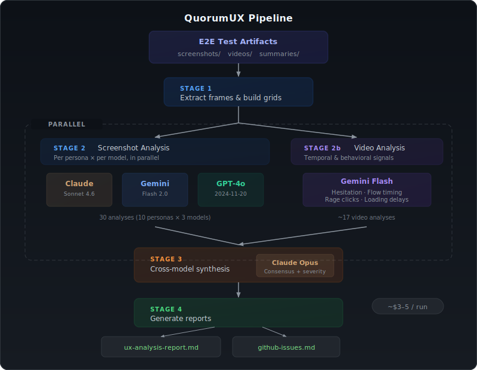

# QuorumUX

[](https://www.npmjs.com/package/quorum-ux)

**Multi-model consensus UX analysis from E2E test artifacts.**

QuorumUX sends your Playwright screenshots and video recordings to multiple AI vision models, then synthesizes their findings into a single prioritized report with consensus-weighted severity. Issues flagged by 2+ models are high confidence. Video analysis catches temporal friction (hesitation, confusion, loading delays) that screenshots miss.

## How It Works

<div align="center">



</div>

## What Makes This Different

Most visual testing tools compare pixels. QuorumUX asks AI models to think like UX researchers.

- **Multi-model consensus** — 3 models analyze independently, a 4th synthesizes. Issues flagged by 2+ models are high confidence. Single-model findings need human review. Disagreements are surfaced explicitly.
- **Video temporal analysis** — Gemini watches your screen recordings and identifies hesitation (cursor pauses), confusion (backtracking), interaction patterns (rage clicks), and loading delays. This catches friction invisible to static screenshots.
- **Persona-aware context** — Feed your test runner's persona summaries (pass/fail/friction counts, known issues) into the analysis. Models evaluate against user intent, not just visual state.
- **Severity synthesis** — Opus weighs evidence from all sources (3 screenshot models + video + test results) and assigns P0/P1/P2 severity with effort estimates.
- **$3-5 per full run** — 10 personas × 3 models + video + synthesis costs pennies via OpenRouter.

## Quickstart

```bash
# Install
npm install quorum-ux

# Interactive setup — walks you through API key, personas, and model selection
npx quorumux init

# Preview what the pipeline will do and estimated cost
npx quorumux --dry-run

# Run the full pipeline
npx quorumux
```

Or configure manually:

```bash
cat > quorumux.config.ts << 'EOF'
import type { QuorumUXConfig } from 'quorum-ux';

const config: QuorumUXConfig = {
  name: 'MyApp',
  description: 'A project management tool for distributed teams',
  domain: 'productivity',
  appUrl: 'https://myapp.com',
  userJourney: 'Signup → Create Project → Invite Team → Assign Tasks → Daily Standup',
  artifactsDir: './test-artifacts',
  models: {
    screenshot: [
      { id: 'anthropic/claude-sonnet-4.6', name: 'claude' },
      { id: 'google/gemini-2.0-flash-001', name: 'gemini' },
      { id: 'openai/gpt-4o-2024-11-20', name: 'gpt4o' },
    ],
    video: { id: 'google/gemini-2.0-flash-001', name: 'gemini' },
    synthesis: { id: 'anthropic/claude-opus-4.5', name: 'opus' },
  },
};

export default config;
EOF

OPENROUTER_API_KEY=sk-or-... npx quorumux
```

## Prerequisites

- **Node.js** >= 18
- **OpenRouter API key** — [openrouter.ai/keys](https://openrouter.ai/keys)
- **ffmpeg** — for video frame extraction (`brew install ffmpeg` / `apt install ffmpeg`)
- **ImageMagick** — for screenshot grids (`brew install imagemagick` / `apt install imagemagick`)
- **Test artifacts** — screenshots and/or video recordings from your E2E test runner (Playwright recommended)

## Artifact Directory Structure

QuorumUX expects your test runner to produce artifacts in this structure:

```
test-artifacts/
└── run-2026-02-22T09-00/           # Timestamped run directory
    ├── videos/
    │   └── P01-maria/               # One subdir per persona
    │       └── abc123.webm          # Playwright video recording
    ├── screenshots/
    │   └── P01-maria/
    │       ├── P01-maria-step01-PASS-login.png
    │       ├── P01-maria-step02-PASS-signup.png
    │       └── P01-maria-step03-FRICTION-onboarding.png
    ├── summaries/
    │   └── P01-maria-summary.json   # Test runner's structured results
    └── executive-summary.md          # Optional: test runner's summary
```

Naming conventions are flexible — QuorumUX discovers personas from subdirectory names.

## CLI Reference

```
npx quorumux [command] [options]

Commands:
  init                          Interactive project setup wizard
  run [options]                 Run the analysis pipeline (default)
  status                        Show project config, API key, and latest run info
  compare <baseline> <current>  Compare two runs side-by-side

Options:
  --config <path>      Path to quorumux.config.ts (default: ./quorumux.config.ts)
  --run-dir <path>     Specific run directory (auto-detects latest run-*)
  --start-stage <n>    Start from stage 1, 2, 3, or 4 (default: 1)
  --skip-video         Skip Stage 2b video analysis
  --dry-run            Show what would run without making API calls
  --output-dir <path>  Write reports to this directory instead of {runDir}/reports/
  --verbose            Verbose output
  --help               Show help

Environment:
  OPENROUTER_API_KEY   API key for OpenRouter (preferred).
                       Also reads from .env / .env.local or ~/.quorumux/config.json.
```

## Pipeline Stages

| Stage | Input | Output | Models Used |
|-------|-------|--------|-------------|
| **1: Extract** | videos/, screenshots/ | frames/, grids/ | None (ffmpeg + ImageMagick) |
| **2: Analyze Screenshots** | grids/, summaries/ | all-analyses-raw.json | All `config.models.screenshot` |
| **2b: Analyze Video** | videos/, summaries/ | all-video-analyses-raw.json | `config.models.video` |
| **3: Synthesize** | All Stage 2/2b output + summaries + exec summary | synthesis.json | `config.models.synthesis` |
| **4: Report** | synthesis.json | ux-analysis-report.md, github-issues.md, ux-analysis-report.json | None (templating) |

Stages 2 and 2b run in parallel. You can start from any stage with `--start-stage`.

## Persona Archetypes

QuorumUX includes 10 built-in persona archetypes for universal UX testing. Select them during `quorumux init` or reference them in your config:

| Archetype | Testing Focus | Device |
|-----------|--------------|--------|
| **Happy Path Hero** | Ideal journey, full completion | Desktop |
| **Speed Runner** | Skip/rush behavior, task efficiency | Desktop |
| **Cautious Explorer** | Reads everything, hesitates | Desktop |
| **Mobile-First User** | Touch interactions, small viewport | Mobile |
| **Accessibility User** | Screen reader, keyboard nav | Desktop |
| **Distracted Multitasker** | Tab switching, mid-flow pauses | Desktop |
| **Error-Prone Novice** | Wrong inputs, recovery paths | Desktop |
| **Power User** | Keyboard shortcuts, advanced features | Desktop |
| **Skeptical Evaluator** | Edge cases, competitor comparison | Desktop |
| **International User** | i18n, locale, long text | Desktop |

When persona IDs match an archetype, QuorumUX automatically injects behavioral context into the analysis prompts so models know what to look for.

## Output: What You Get

### ux-analysis-report.md

- **Overall assessment**: UX score (1-10), launch readiness, strengths, critical path
- **Consensus issues**: High-confidence findings from 2+ models, with video insight annotations
- **Video-only issues**: Temporal friction invisible to screenshots (hesitation, loading, confusion)
- **Model-unique issues**: Single-model findings that need human review
- **Disagreements**: Where models actively contradict each other

### github-issues.md

Ready-to-paste `gh issue create` commands for every finding, with severity labels and structured descriptions.

### ux-analysis-report.json

Flat JSON with all issues (consensus, video-only, model-unique) in a single array with `type` discriminator. Includes score, launch readiness, models, personas, strengths, and critical path. Designed for CI integration and dashboards.

### synthesis.json

Raw structured data for programmatic consumption or custom reporting.

## Integrating with Your Test Runner

QuorumUX is test-runner agnostic. It consumes artifacts, not test code. Any runner that produces screenshots and/or video works:

- **Playwright** (recommended): Use `recordVideo` on browser context + `page.screenshot()` at checkpoints
- **Cypress**: Use `cy.screenshot()` + video recording config
- **Puppeteer**: Use `page.screenshot()` + screen recording via Chrome DevTools Protocol

The optional `summaries/*.json` files give QuorumUX additional context (pass/fail counts, known issues) but aren't required. Without them, analysis is purely visual.

## Cost

Typical cost for a 10-persona run via OpenRouter:

| Stage | Models | ~Cost |
|-------|--------|-------|
| Screenshots | 3 models × 10 personas | ~$1.50 |
| Video | Gemini × 10-12 videos | ~$0.50 |
| Synthesis | Opus × 1 call (~60K tokens) | ~$1.50 |
| **Total** | | **~$3.50** |

## License

MIT
